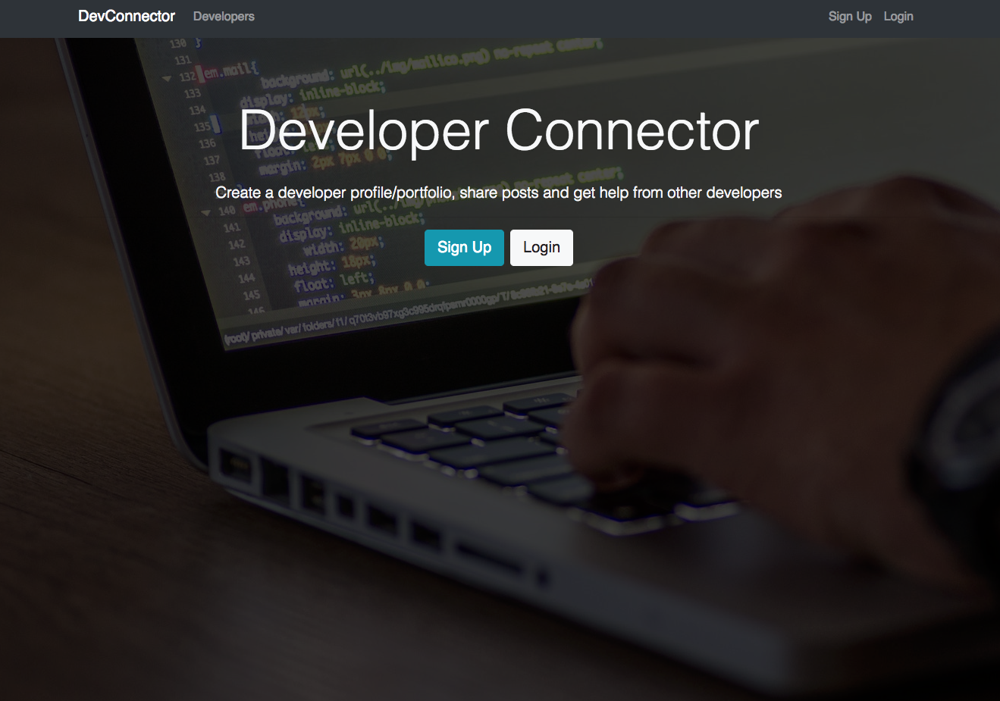
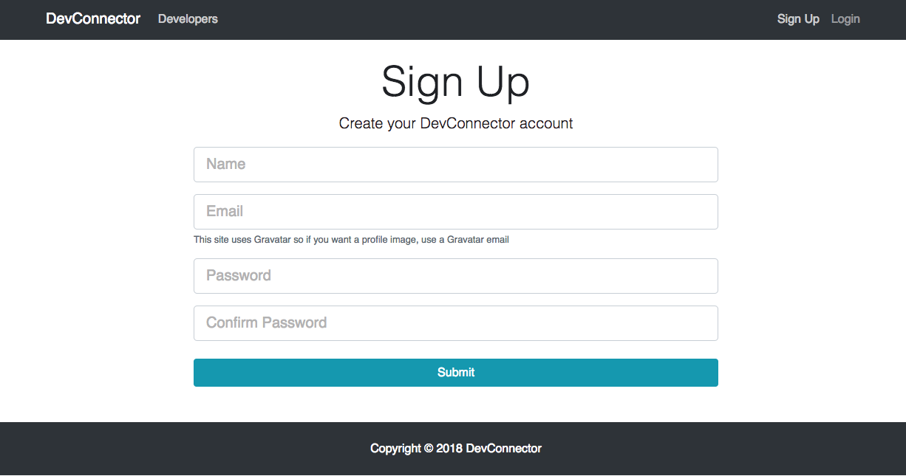
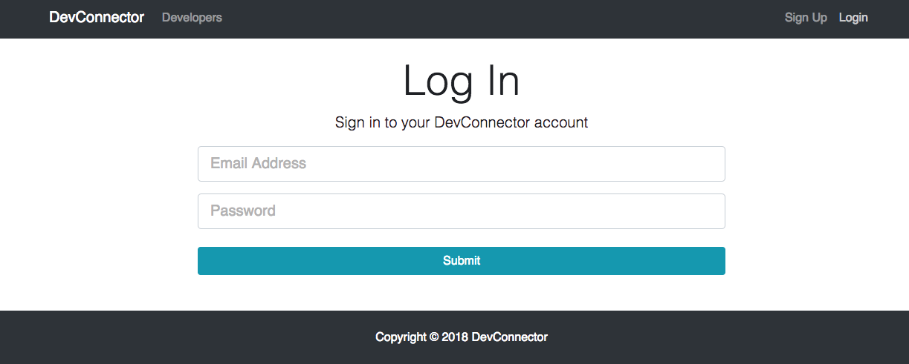
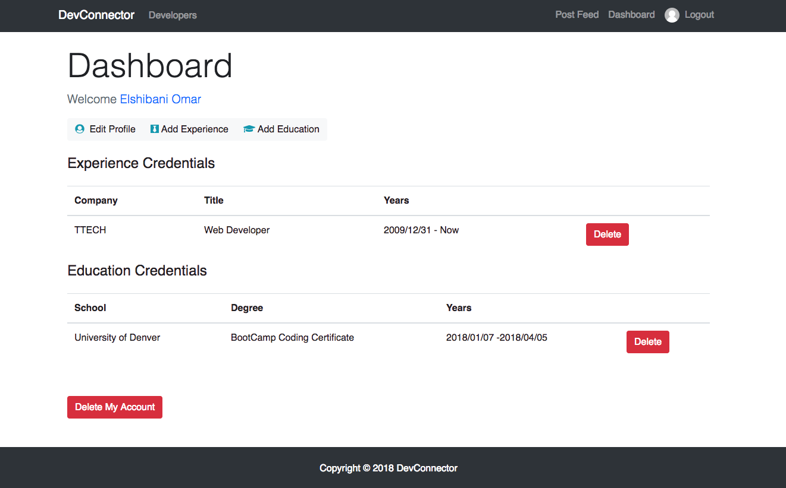
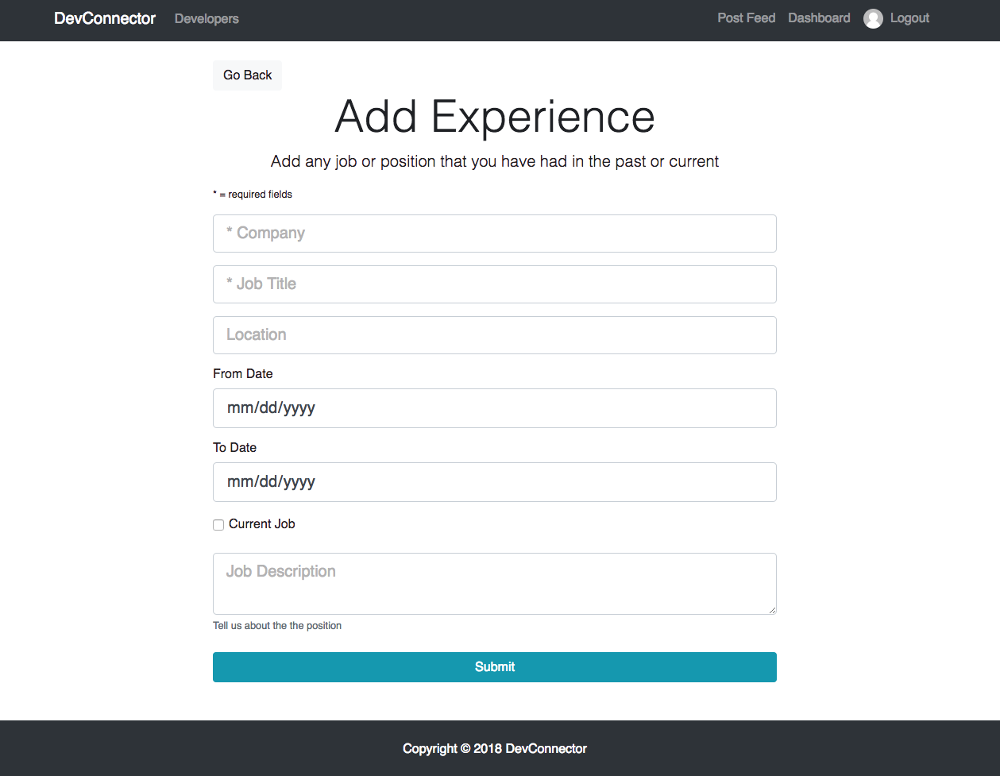
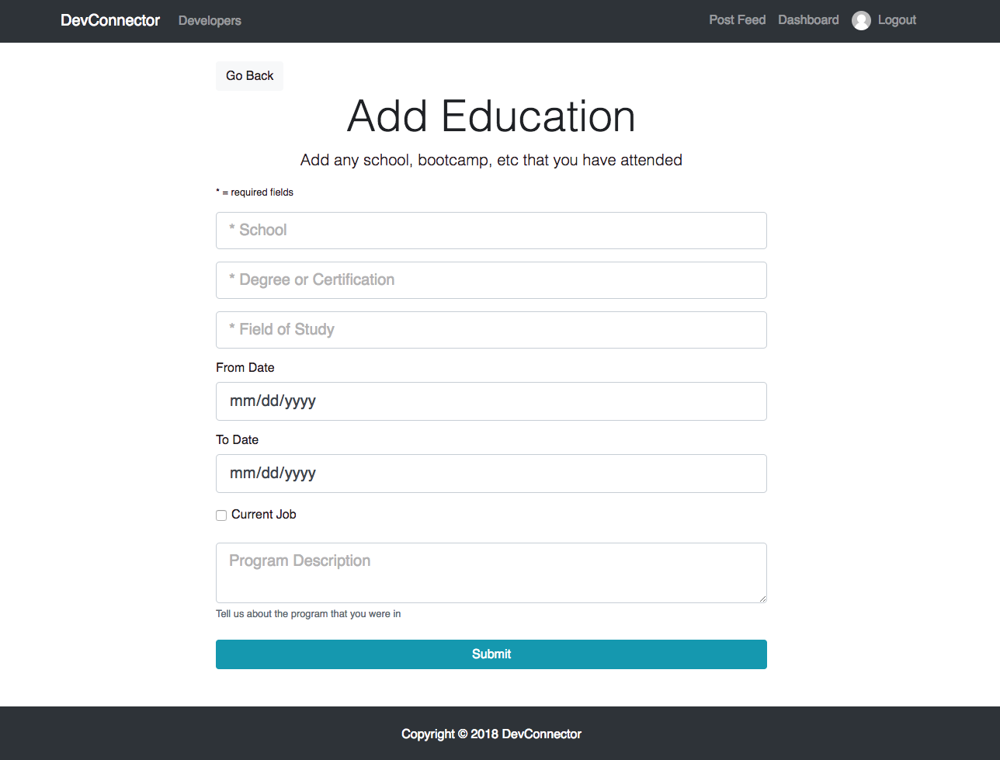
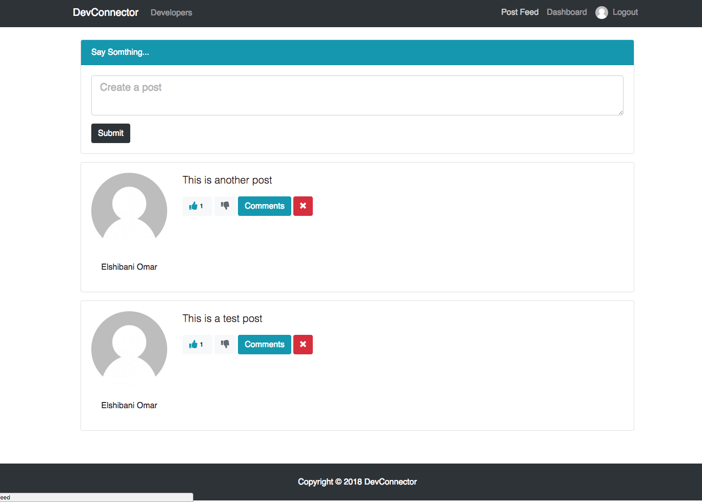
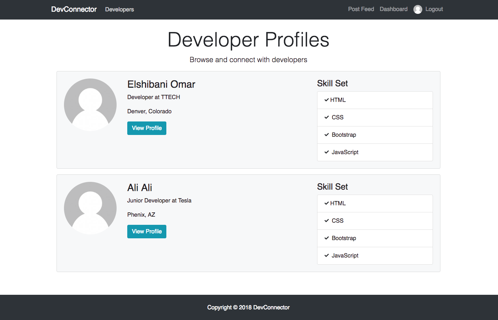

# devconnector

MERN application: Social network for developers to connect. They can create account, profile, add experience, add education, add post, GitHub account info, and comment on posts.

Live link: <a href="https://arcane-mountain-63886.herokuapp.com/" target="_blank"> Click here</a>

## Technologies

- React
- React-router-dom
- Axios
- Classnames conditional
- Redux
- react-redux
- redux-thunk
- jwt-decode
- Moment
- React-moment
- Express
- Body Parser
- Mongoose
- MongoDB
- Passport
- Passport-jwt
- BcryptJS
- Validator
- Gravatar
- Concurrently

 

 

 

 

 

 

 

 

